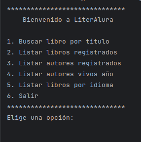
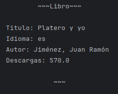
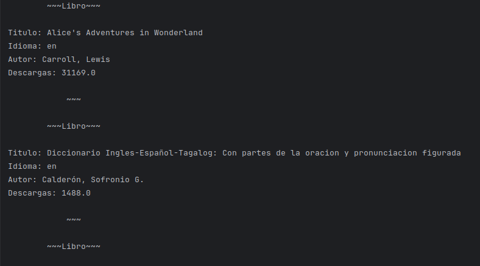
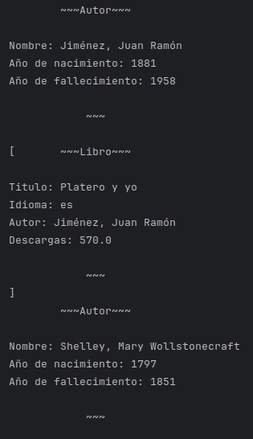
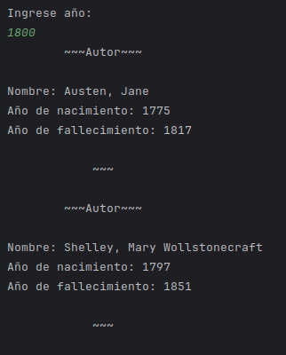
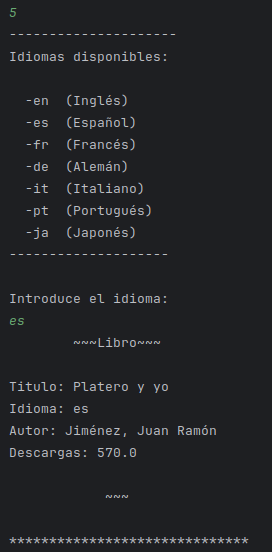

CHALLENGE-LITERALURA

## Objetivo: 

El proyecto es parte del programa Oracle Next Education y Alura Latam, un desafío donde se simula la rutina diaria de un desarrollador back-end. Se trata de crear una aplicación con conexión a una base de datos relacional, utilizando conceptos avanzados de Java y Spring como consumo de APIs externas y persistencia de datos. El objetivo es desarrollar un Catálogo de Libros interactivo para usuarios, ofreciendo al menos 5 opciones de interacción vía consola. Se empleará la API Gutendex del proyecto Gutenberg para buscar los libros, la cual proporciona datos en formato JSON.

API [Gutendex](https://gutendex.com) 

## Tecnologias utilizadas

- Java JDK: versión: 17 en adelante 

- Maven: versión 4 en adelante

- Spring: versión 3.2.3 - https://start.spring.io/

- Postgres: versión 16 en adelante - 

- IDE (Entorno de desenvolvimento integrado) IntelliJ IDEA- opcional -

Configuración al crear el proyecto en Spring Initializr:

- Java (versión 17 en adelante)

- Maven (Initializr utiliza la versión 4)

- Spring Boot (versión 3.2.3)

- Proyecto en JAR

Dependencias para agregar al crear el proyecto en Spring Initializr:

- Spring Data JPA

- Postgres Driver

## Cómo probar esta API

Modificar el archivo: [application.properties](./literalura/src/main/resources/application.properties) reemplazando las varibles DB_NAME, DB_USER, DB_PASSWORD por el nombre de una base de datos creada, el nombre de usuario y contraseña respectivamente o declarado las variables de entorno de su sistema operativo, luego ejecutar el archivo LiteraluraApplication.java.

## Funcionalidad

### Menú Principal:

1. **Buscar libro por titulo:** 
Busca un libro en la API, si no esta registrado en la base de datos, lo guarda; sino informa que el libro ya se encuentra registrado. En ambos casos imprime la información del libro

2. **Listar libro registrados**
Lista los libros guardados en la base de datos en orden lexicográfico en caso de haber, caso contrario imprime: "No se encontraron libros registrados"

3. **Listar autores registrados**
Lista los autores registrados en orden lexicográfico en la base de datos, en caso de no haber autores registrados, imprime: "No se encontraron autores registrados".

4. **Listar autores vivos año**
Lista los autores vivos según el año que el usuario ingrese.

5. **Listar libros por idioma**
Lista los libros por el idioma que el usuario ingrese. Se ofrece al usuario un menú con las opciones a ingresar. 

6. **Salir**
Sale del programa

 
